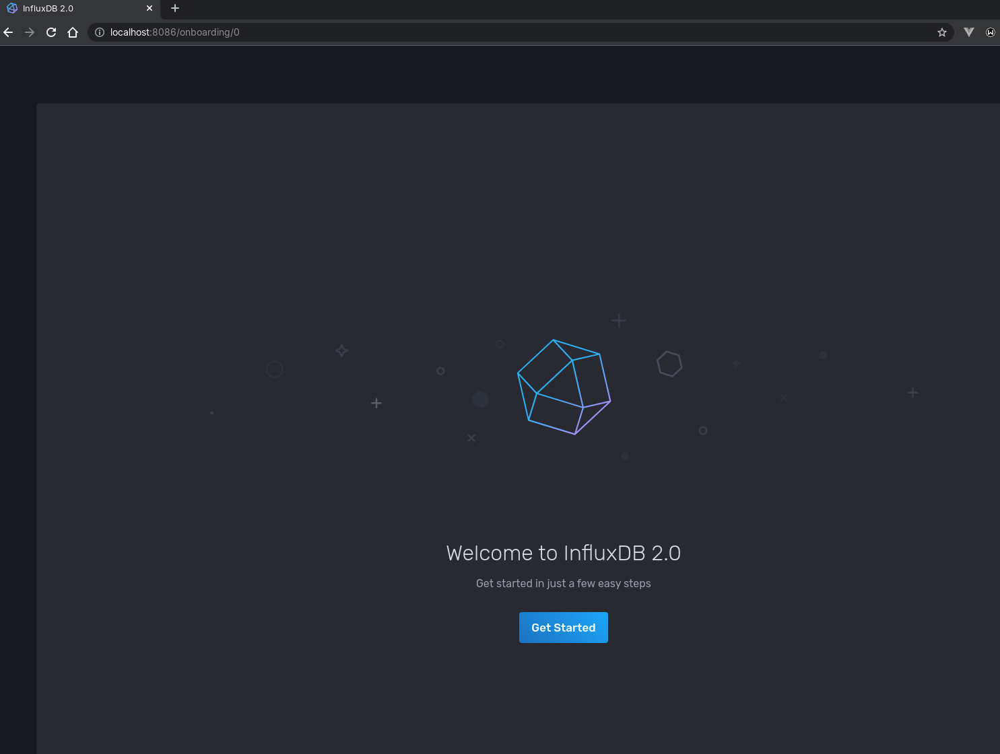
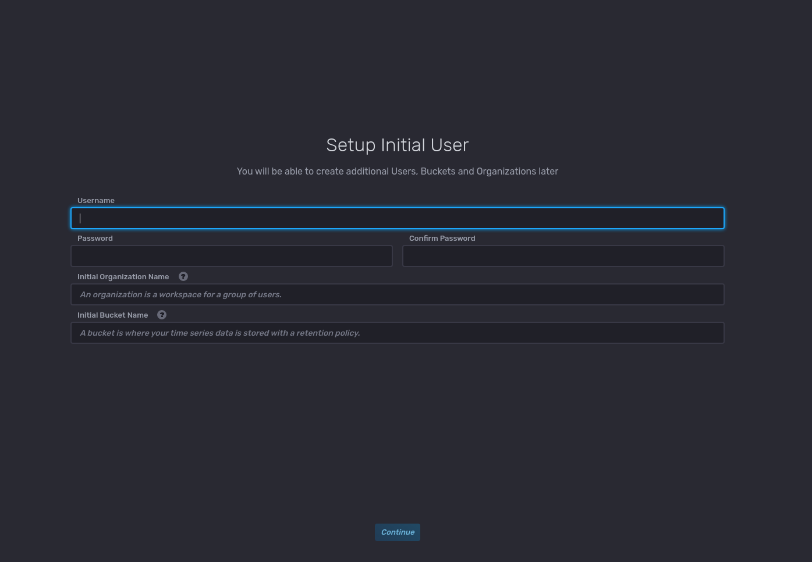
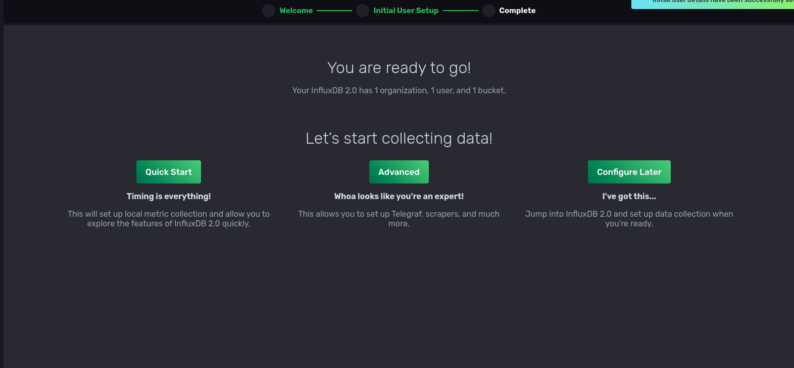
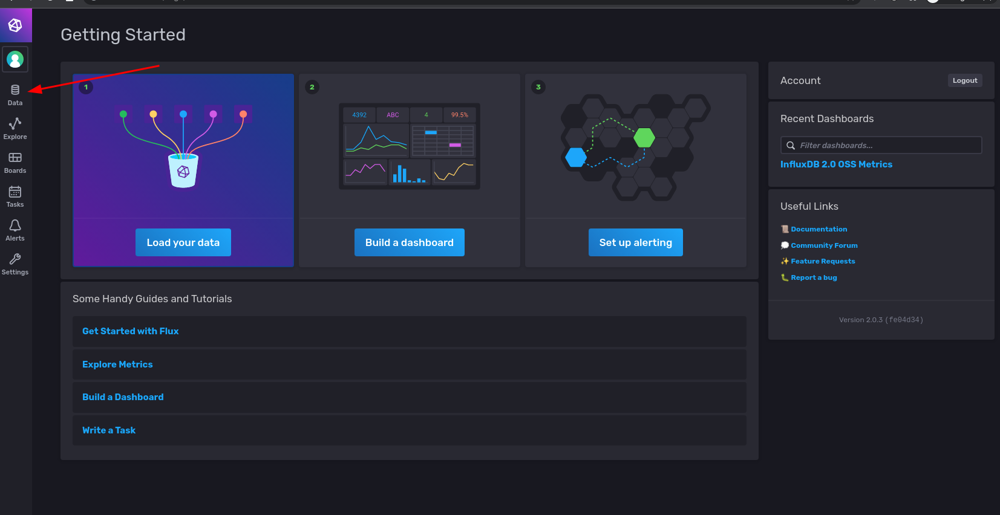
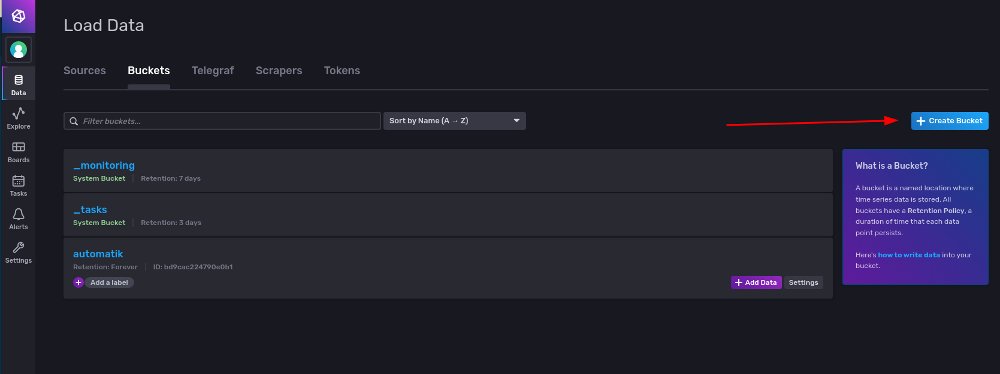
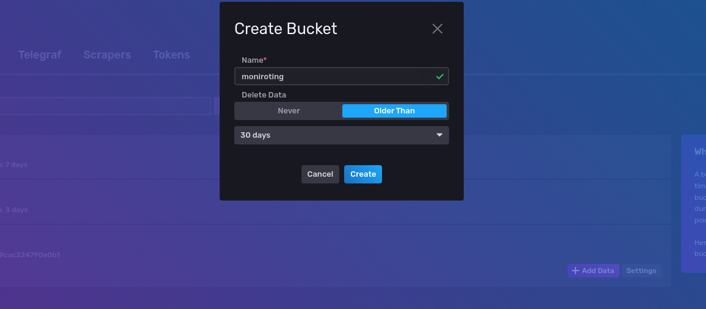
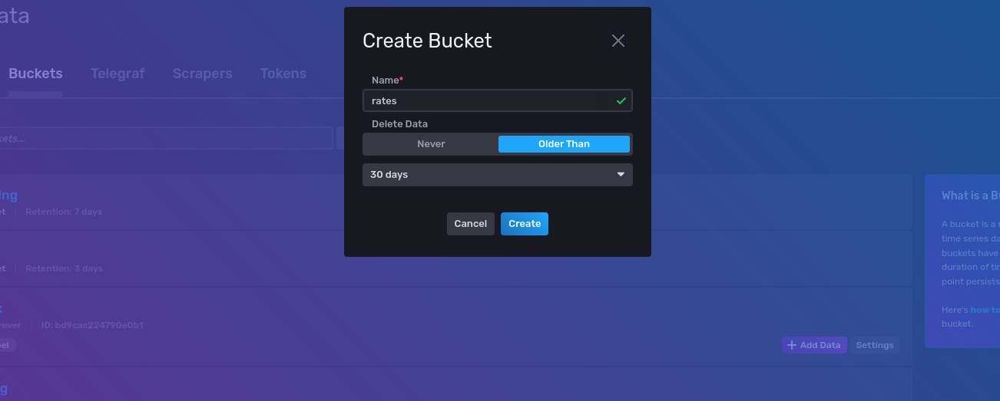
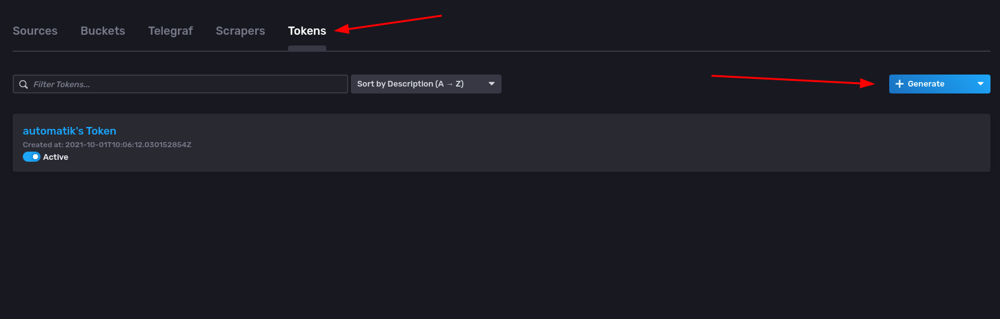
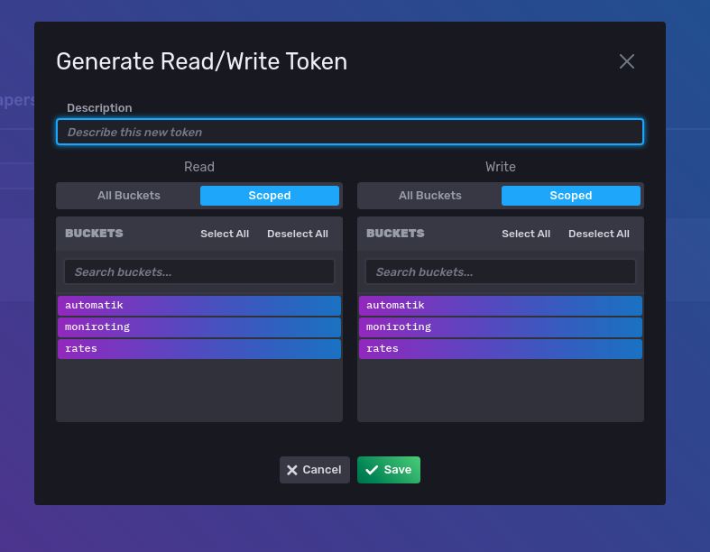
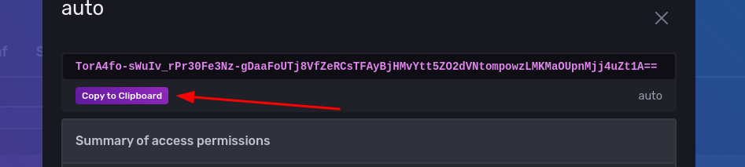

# InfluxDB Configuration

- [Open page](http://localhost:8086)
  

- Create initial username, password, organization name and bucket name
- Organization name must be "automatik"

- Click on 'Data'

- Create bucket named 'monitoring' and 'rates'. Optionally you can set a retention period.

- Create a token that we will use to read and write data to InfluxDB

- Copy token somewhere safe. You will use this token in a minute.

## Next Step

[Configure Minio](minio_config.md)
