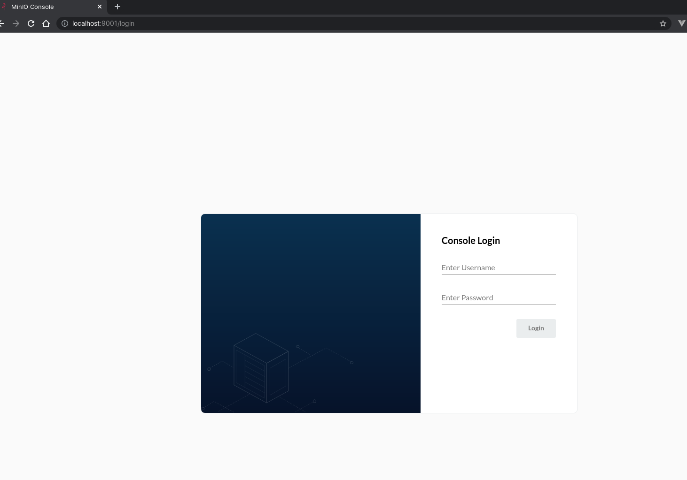
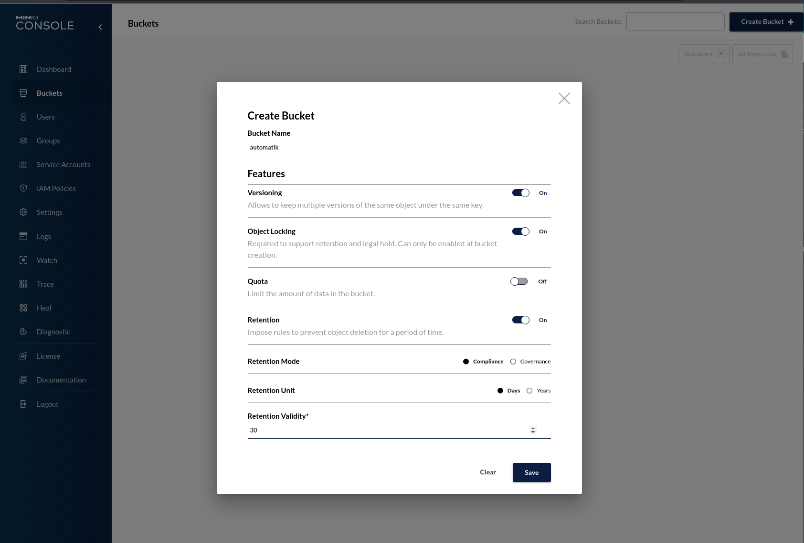
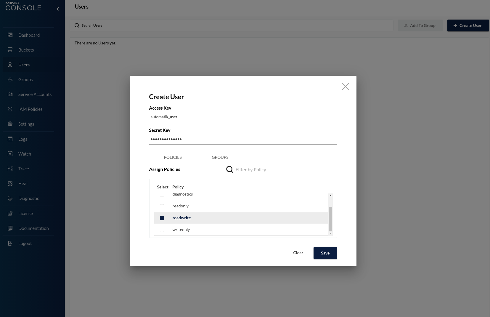

# Minio Configuration

- Open page http://localhost:9001

- Login using username / password you selected before.
- Create a bucket. Optionally you can set advanced settings. This bucket will be used for backup files

- Create an access key, secret key and assign read write policy 

- You will use access key and secret key information on the next step.